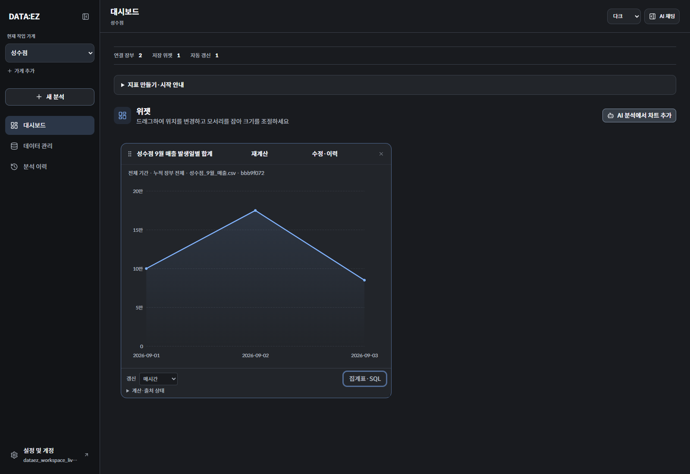

# DATA:EZ

**흩어진 매출 파일을 모으고, 자연어로 통계와 그래프를 만들어 다시 계산할 수 있는 대시보드에 저장하는 서비스입니다.** 한 계정에서 여러 가게를 운영하는 소상공인을 대상으로 합니다.

CSV·엑셀과 현금 기록을 관리하고, 필요한 파일을 채팅에서 찾아 분석합니다. LLM이 구조화된 지표 정의를 만들면 서버가 출처·권한·계산 조건을 검증하고 SQL로 집계합니다. 그래프와 함께 정확한 집계표, 실행 SQL, 기간과 출처를 확인할 수 있습니다.

[제품 요구사항](docs/PRD.md) · [전체 문서](docs/README.md) · [최신 통합 검증](docs/WORKSPACE_LIVE_ACCEPTANCE.md) · [브랜치 머지 기록](docs/RELEASE_INTEGRATION.md)



위 화면은 합성 매출 데이터로 실제 브라우저·API·DB·LLM을 연결해 검증한 결과입니다.

## 사용 흐름

1. 가게를 만들고 파일을 보관함에 올립니다. **샘플 데이터로 시작**하면 별도 샘플 가게에서 시작할 수 있습니다.
2. 파일의 컬럼·값을 검사하고 분석에 연결합니다. 반복 반영할 결제 출처는 중복·충돌 검토를 거쳐 장부에 누적합니다.
3. 채팅에서 보관 파일을 고르고 **파일 원본만 / 누적 장부 전체** 중 분석 범위를 확인합니다.
4. “일별 결제액을 그래프로 보여줘”처럼 질문하고, 결과의 기간·출처·계산 근거를 확인합니다.
5. 재계산 가능한 결과는 이름·단위·기간·갱신 주기를 검토하고 미리보기 후 대시보드에 저장합니다.
6. 위젯을 이동·리사이징하고, 수동 또는 서버의 주기 실행으로 저장된 정의를 다시 계산합니다.

## 현재 기능

| 영역 | 구현 범위 |
|---|---|
| 가게와 파일 | 계정별 여러 가게, 원본 보관·다운로드·미리보기, 보관함 파일 검색·선택 |
| 매출 기록 | CSV/XLSX 검사·매핑, 출처별 반복 반영, 중복·충돌·부분 취소 검토, 현금 직접 입력 |
| 자연어 분석 | 출처 검색, 지표 생성·후속 질문, 차트·정확한 집계표·SQL 근거 |
| 저장 지표 | 단일 장부, 여러 장부 합계, 스칼라·그룹 계산식, 명시적으로 선택한 여러 가게 비교 |
| 대시보드 | 저장 전 설정, 중복 저장 방지, 정의 수정·이력·복원, 배치 저장, 수동·매시간·24시간 갱신 |
| 화면 | Spoqa Han Sans Neo, Charcoal + Blue, 다크 기본·라이트·시스템 테마, 오른쪽 접이식 채팅, 모바일 대응 |
| 검색 관리 | 파일·장부 카탈로그와 문서 RAG, DB에 보관되는 색인 작업·재시도·실패 상태 |

파일을 새로 선택할 때는 **원본만**이 기본입니다. 원본 분석은 저장된 파일의 행을 유지하고, 누적 장부 분석에는 이후 반영한 거래도 포함합니다. 저장 지표는 선택한 출처를 유지하며 갱신 때 다른 파일을 자동으로 고르지 않습니다. [분석 범위와 저장 계약](docs/FILE_SCOPE_AND_FIRST_USE.md)

주기 갱신은 서버에 이미 있는 데이터를 다시 계산합니다. PG 사이트의 새 매출을 수집하는 기능은 없으며, 정상적인 지표 재계산에는 LLM을 호출하지 않습니다. 정의가 없는 기존 정적 그래프는 결과 스냅샷으로 저장합니다.

## 로컬 실행

포트폴리오용으로 반복 체험할 때는 [지속형 데모 안내](docs/DEMO_RUNBOOK.md)를 따릅니다. `.env`에 모델 키를 설정한 뒤 `python scripts/demo/run.py start`로 시작하면 별도 DB·원본 볼륨과 실행 설정을 유지합니다. 예시 대시보드 보기와 샘플 체험 다시 시작을 제공합니다.

Docker와 Docker Compose, 사용할 수 있는 모델 API 키가 필요합니다. 로컬 파일 저장소가 기본이므로 별도 클라우드 저장소 없이 실행할 수 있습니다. 저장소 루트에서:

```powershell
Copy-Item .env.example .env
# .env의 OPENAI_API_KEY를 설정합니다.
docker compose up --build
```

기존 `.env`가 있다면 복사 대신 필요한 값을 확인합니다. macOS/Linux에서는 `cp .env.example .env`를 사용할 수 있습니다.

- [웹 앱](http://localhost:3000): 회원가입·로그인 후 가게 또는 샘플 가게에서 시작
- [API 문서](http://localhost:8000/docs): 현재 엔드포인트와 요청 스키마
- [상태 확인](http://localhost:8000/health) · [준비 상태](http://localhost:8000/ready) · [메트릭](http://localhost:8000/metrics)

`.env.example`의 DB·JWT 값은 로컬 개발용입니다. 개별 서버 실행, 환경변수와 마이그레이션은 [개발 안내](CONTRIBUTING.md), [설정](docs/CONFIGURATION.md), [실행·배포](docs/DEPLOYMENT.md)를 참고하세요.

## 구조와 기술

```text
파일 보관 / 매출 반영 → 가게별 장부·문서 / 원본 분석 자료
                              ↓
채팅 → 파일·카탈로그 검색 → 검증 가능한 지표 정의
                              ↓
                   권한·출처·계산 조건 검사 → SQL 집계
                              ↓
                 차트·집계표·실행 근거 → 설정 검토·저장
                                              ↓
                                서버가 같은 정의를 주기 재실행
```

| 레이어 | 기술 |
|---|---|
| Web | Next.js 16, React 19, TypeScript, Tailwind 4, shadcn/ui |
| 시각화 | Apache ECharts 6.1.0, SVG 렌더러, react-grid-layout |
| API | FastAPI, psycopg3, OpenAI 도구 호출, SSE |
| 데이터·검색 | PostgreSQL 16, pgvector, 한국어 형태소 기반 전문 검색, RRF |
| 원본 저장 | 로컬 디스크 또는 S3 호환 저장소 |
| 요청 제한 | 단일 API 프로세스의 메모리 기반 제한, 동시 요청 보호·만료 기록 정리 |
| 관측성 | Prometheus, 구조화 로그, 단계별 토큰·비용·지연 기록 |

[아키텍처](docs/ARCHITECTURE.md)에서 지표 정의 v1–v5, 원본 불변성, 소유권 검사와 백그라운드 작업을 설명합니다. 초기 관측성·라우터·한국어 검색 개선 과정은 [엔지니어링 기록](docs/ENGINEERING_HISTORY.md)에 보존했습니다.

배포·포트폴리오 데모의 기본 구성은 **웹·API·PostgreSQL**입니다. Redis 의존성은 제거했으며, 요청 제한은 API 1개 프로세스 안에서 유지됩니다. API 재시작 시 요청 횟수는 초기화됩니다. 여러 API 프로세스나 서버를 운영할 때 공유 요청 제한 도입을 다시 검토합니다.

## 검증 상태

2026-09-11 기준입니다. 서로 다른 범위의 검사이며 통과 수를 합산하지 않습니다.

| 검증 | 결과와 범위 |
|---|---|
| 새 파일·질문 Phase 3 | 실제 API·PostgreSQL·LLM: 최초 28/30 보존, 보완 후 전체 30/30, 별도 10/10. 치명 조건 위반 0건. [자료·출처·설명·저장 상태 평가](docs/UNSEEN_DATA_ACCEPTANCE.md) |
| Redis 의존성 제거 후 | API 487 passed / 239 skipped, 새 API 이미지·실제 PostgreSQL로 준비 상태와 요청 제한 확인 |
| 이번 머지 전 전체 API 테스트 | 481 passed / 239 skipped — 외부 테스트 DB·선택 의존성 없는 로컬 환경 |
| 오프라인 라우팅 데이터셋 검사 | 65개 사례, 알려진 도구 32개 참조 유효성 통과; 실제 모델 정확도 평가와 별개 |
| 평가 도구·샘플 | 평가 도구 25개 테스트, CSV 12개 체크섬, 엑셀 533개 셀 비교 통과 |
| 최신 원본 범위·저장·샘플 회귀 | 관련 API 222 passed / 67 skipped, 브라우저 fixture 32개 흐름 통과 |
| 최신 실제 작업 공간 통합 | 실제 브라우저·API·DB·LLM, 자연어 질문 6개·확인 항목 29개 통과 |
| 이전 자연어 50문항 평가 | 전체 재평가 47/50, 보완 후 관련 10문항 10/10; 전체 50/50으로 합산하지 않음 |
| PR #11–#13 CI | 각 PR의 API 테스트·웹 빌드·API 및 웹 Docker 빌드 통과 |

자동 갱신 시험은 테스트 위젯의 예정 시각을 앞당겨 실제 서버 스케줄러를 실행했습니다. 한 시간이 실제로 경과한 시험은 아닙니다. [통합 검증의 환경·한계](docs/WORKSPACE_LIVE_ACCEPTANCE.md), [자연어 평가](docs/NATURAL_LANGUAGE_ACCEPTANCE.md)에 원시 근거를 연결했습니다.

간단한 검사:

```powershell
python -m pytest api/tests/ -q
python -m pytest scripts/nl-eval/test_oracle.py scripts/nl-eval/test_report.py -q
python scripts/pg-eval/verify_samples.py
npm.cmd --prefix web run build
```

Python·Node 의존성 설치와 실제 DB·브라우저 실행 조건은 [개발 안내](CONTRIBUTING.md)를 따릅니다. API 테스트는 설정되지 않은 외부 검사를 건너뛰며, 이를 실제 DB 검증 통과로 해석하지 않습니다.

## 남은 범위

지속형 데모, 내부 사용성 개선, 새 파일·질문 평가를 완료했습니다. **Phase 2의 실제 사용자 관찰은 대기** 상태이며, 관찰에서 드러난 막힘과 범위 이해 문제를 다음 개선 대상으로 삼습니다. 작업 범위·산출물·완료 조건은 [다음 Phase 계획](docs/NEXT_PHASE_DEMO_AND_QUALITY.md)을 참고하세요.

사용자 관찰에 앞서 [AWS 단일 서버 공개 데모](docs/PUBLIC_DEPLOYMENT.md)를 준비 중입니다. 브랜드·Phase 3 코드를 배포 브랜치에 통합하고 HTTPS 설정을 검증하며, 공개 서버 생성과 서비스 주소는 아직 확정 전입니다.

실제 PG 파일·외부 결제 연동은 서비스 일정이 정해질 때까지 보류합니다. 원격 저장소 연결, 실제 사용자 사용성, 더 넓은 비정형 입력과 운영 부하는 후속 검증입니다. 현재 결과는 합성 자료를 사용한 개발 검증이며 금융 거래 실행이나 세무 신고를 제공하지 않습니다.

## 라이선스

[MIT](LICENSE). 포함한 웹폰트와 ECharts의 별도 라이선스·NOTICE는 [폰트 출처](web/app/fonts/README.md)와 [시안 폴더](outputs/frontend-design/README.md)에 보관합니다.
