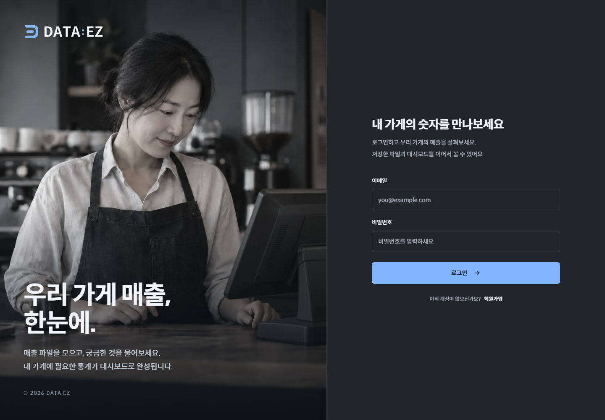

# 서버리스 작업 통합 및 로그인 디자인 배포

2026-09-11. 누적 변경사항을 작업 브랜치에서 두 커밋으로 정리하고 main에 fast-forward 통합한 뒤 GitHub에 push했다. 새 로그인 디자인은 [공개 웹](https://dataez.vercel.app)에 적용되었다.

## 소스와 배포

- 작업 브랜치: `codex/serverless-login-release`.
- `aff0640`: 서버리스 API, Supabase 파일 업로드, 요청 제한·정기 작업, 검증 도구와 문서.
- `3944cf9`: 저채도 POS 사진, 로그인·회원가입 폼, 확정 카피, 이미지 비교 도구.
- 배포 앱 소스: `3944cf9b52773ef4500c7fedbad46a08a827b338`. 이후 문서 커밋은 앱 소스를 변경하지 않는다.
- 웹 Production: `dpl_FjpkUGwngcjii2UoCiBqTLgM8u9W`, READY.
- 배포 주소: https://dataez-9y6xltx1q-gnb1202-navercoms-projects.vercel.app (개별 배포 주소는 보호됨).
- 사용자용 고정 주소: https://dataez.vercel.app.
- API는 기존 `dpl_BybKUqtiLSfE8ECmUWQNnWXo1nQ6`를 유지한다. 배포 매니페스트의 API 파일 90개가 저장소 작업 파일과 모두 일치함을 SHA-256으로 확인했다.

첫 웹 배포 `dpl_FunR62xXkEPBEaWehuCySk8JxxbX`는 새 JSX와 이전 CSS가 함께 나타났다. 빌드 캐시를 사용하지 않는 `vercel deploy --prod --yes --force`로 재배포하여 해결했다. 최종 검증은 위의 새 Production과 고정 공개 주소에서 수행했다. 다음 디자인 배포에서도 빌드 성공 여부뿐 아니라 실제 CSS·이미지를 확인해야 한다.

## 검증

- API 테스트: 525 통과, 별도 DB가 필요한 260 건너뜀.
- 별도 임시 PostgreSQL 검증: 44 통과. 업로드·소유권·정기 작업·공유 요청 제한 포함. 테스트 컨테이너는 종료 후 제거했다.
- 기존 브랜드 UI 검사: 28 화면 통과. 다크·라이트, 로그인·회원가입, 대시보드 탐색, 모바일 포함.
- GitHub [Tests](https://github.com/gnb1202/DATAEZ/actions/runs/34579002624)와 [Docker Build](https://github.com/gnb1202/DATAEZ/actions/runs/34579002691): 앱 소스 커밋 기준 성공.
- Vercel Next.js 16.3.4 Production 컴파일·TypeScript·정적 페이지 생성 성공. npm audit 취약점 0.
- 공개 브라우저: 확정 카피, 활성 로그인 폼, 채도 25%, 다크·라이트 및 모바일 회원가입 전환 확인. 페이지 오류 0.
- 공개 WebP: 80,984 bytes. 로컬 서비스 파일과 SHA-256 일치.
- API `/health`, `/ready`: 200. 인증 없는 `/api/projects`: 403, 내부 maintenance 상태: 401.
- 커밋 대상 128개 파일에서 로컬 자격증명 값과 주요 비밀 키 패턴을 검사했으며 발견 사항 없음. 환경변수·CLI 자격증명·임시 산출물은 제외했다.

[공개 검증 결과](evaluations/login-release/verification.json). 이번 공개 브라우저 검사는 계정을 생성하거나 데이터를 변경하지 않는다. 실제 로그인·업로드·LLM·저장·재계산 검증은 [직전 공개 데모 기록](PUBLIC_DEMO_ACCEPTANCE.md)을 참고한다.

## 다음 작업

포트폴리오용 시연 영상과 설명 자료를 준비한다. 로그인 이미지와 카피 결정은 [디자인 결정 기록](LOGIN_IMAGE_DECISION.md)에 정리했다.
