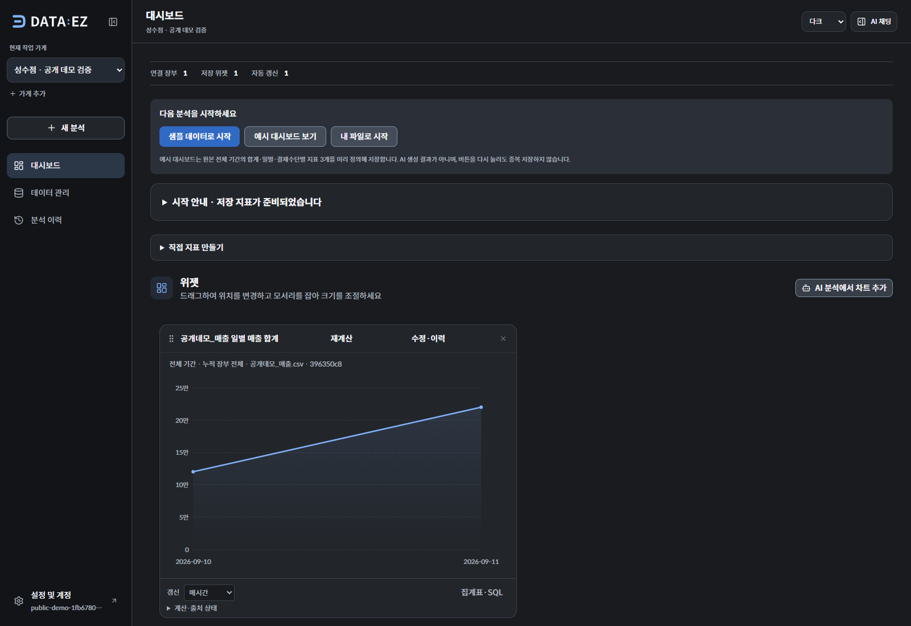

# 공개 데모 배포와 종합 검증

2026-09-11. **프론트와 API를 Production에 연결하고 실제 브라우저·Supabase·LLM 흐름을 검증했다.**

| 구성 | 공개 주소 / 상태 |
| --- | --- |
| 웹 | https://dataez.vercel.app — Next.js 16.3.4, Production READY |
| API | https://dataez-api.vercel.app — Python 3.12, 서울, Production READY |
| DB·원본·색인·스케줄 | Supabase DATAEZ, 기존 Free 프로젝트 |
| 별도 AWS·Redis | 사용하지 않음 |

웹 배포 ID는 `dpl_5gmbjZqxi1jUYQxEMyQRfkJzrLtL`, API는 `dpl_BybKUqtiLSfE8ECmUWQNnWXo1nQ6`다. [배포 메타데이터](evaluations/public-demo/deployments.json).

## 공개 연결

- API Production에 기존 검증된 DB·Storage·JWT·LLM·maintenance 설정 13개를 적용했다. 서버 비밀 값은 Vercel sensitive 환경변수로 저장했다.
- 웹에는 `NEXT_PUBLIC_API_URL=https://dataez-api.vercel.app`만 연결했다. 서버 비밀 키나 Vercel 보호 우회 토큰을 브라우저에 전달하지 않는다.
- API `/health`와 `/ready`는 200, 인증 없는 계정 API는 403, 내부 maintenance는 401을 반환했다.
- CORS는 `https://dataez.vercel.app`을 허용하고 다른 origin은 허용하지 않는 것을 확인했다.
- 기존 Vercel Standard Protection을 유지했다. Production 고정 주소는 공개되고 Preview/개별 배포 주소의 보호는 유지된다.
- Supabase Cron 목적지를 고정 주소 `https://dataez-api.vercel.app`으로 바꿨다. 향후 정상 Production 배포 시마다 Cron URL을 교체할 필요가 없다.
- DB·원본·AI 제한은 [서버리스 실행 제한](SERVERLESS_RELEASE_GUARDS.md)을 따른다. 요청 횟수 제한은 금액 기준 과금 상한이 아니다.

## 실제 사용자 흐름

API나 Storage 응답을 모의하지 않고, 공개 웹에서 임시 계정으로 수행했다.

1. 로그인하고 가게의 작업 공간에 진입.
2. CSV를 브라우저에서 Supabase에 직접 업로드하고 원본 미리보기 확인.
3. 원본을 장부에 연결하고 **누적 장부 전체** 범위를 명시적으로 선택.
4. 자연어로 “날짜별 매출 합계를 원 단위 선그래프로, 새 거래를 추가하면 다시 계산할 수 있는 지표로 만들어줘” 요청.
5. 실제 LLM이 `preview_metric`을 실행해 SQL 집계와 재계산 가능한 그래프 생성. 일별 금액 **120,000원 / 170,000원** 확인.
6. 단위·매시간 갱신 주기를 검토하고 대시보드에 저장.
7. 다음 날짜에 50,000원 거래를 추가한 뒤 재계산하여 **120,000원 / 220,000원** 확인.
8. 페이지 새로고침 뒤 저장 지표 1개, 매시간 설정, 변경된 집계가 유지됨을 확인. 다크·라이트 화면 기록.

브라우저 검사 4개 묶음이 통과했고 페이지 오류는 0개다. [결과와 실제 AI 응답](evaluations/public-demo/browser.json), [인증·CORS 검사](evaluations/public-demo/deployment-check.json).



## 정기 작업

Production 목적지로 실제 Supabase Cron의 분 단위 색인·지표 갱신을 기다려 검증했다.

- 문서·스키마 임베딩 저장 및 검색 준비 완료.
- 저장 지표가 **100 → 300**으로 갱신되고 다음 실행 시각이 이동.
- 만료 업로드 제거, 유효한 업로드 유지.
- 내부 호출의 인증 없는 요청과 잘못된 인증 거절.

6개 검사가 통과했다. 만료 정리는 10분을 기다리는 대신 동일 `pg_net` 전송을 직접 실행했다. [Production 정기 작업 결과](evaluations/vercel-api/maintenance-cron.json). 이전 Preview 개발 중 기록된 index 실패 카운터 1은 이력으로 남아 있으며 이번 실행은 성공했다.

## UI 회귀 검사 보완

`import-validation.cjs`, `ledger-imports.cjs`, `workspace.cjs`에 현재의 보관함 샘플 조회와 업로드 capabilities 응답을 반영했다. 가게를 바꾸면 대시보드로 돌아오는 동작에 맞춰 매출 가져오기 검사에서 데이터 관리 화면을 다시 연다.

- 가져오기 오류 표시·파일 보존·재시도: 통과.
- 출처 매핑·미리보기 충돌·중복 재업로드·가게 전환: 통과.
- 작업 공간 14개 검사: 통과. 입력 보존, 한국어 IME, 늦은 응답의 가게 격리, 저장, 드래그·리사이즈, 모바일 키보드/화면, 다크·라이트 포함.
- 이전 라이트 tooltip 배경 실패는 이번 실행에서 재현되지 않았다. 앱 스타일은 변경하지 않았다.

[회귀 검사 요약](evaluations/public-demo/ui-regression.json). 이 검사들은 API fixture를 사용하며, 위 공개 검증은 실제 서비스를 사용한다. 이 단계에서는 API 구현을 변경하지 않아 앞 단계의 API 525개·별도 DB 44개 검증을 다시 실행하지 않았다. 웹 Production 빌드와 TypeScript 검사는 성공했다.

## 데이터·보안·재검증

임시 테스트 계정·가게·장부·지표·업로드 파일을 모두 정리했다. 사용자 데이터나 다른 Supabase 프로젝트는 변경하지 않았다. 실제 사용에 대한 요청 카운터와 maintenance 실행 이력은 유지한다. 보안 Advisor의 ERROR/WARN은 0개였으며 서버 전용 RLS 테이블의 정책 없음 INFO는 기존 접근 구조에 해당한다. [해당 INFO 설명](https://supabase.com/docs/guides/database/database-linter?lint=0008_rls_enabled_no_policy).

```powershell
# 공개 웹과 실제 LLM 사용. 임시 계정과 데이터를 생성하고 종료 시 제거한다.
python scripts/serverless/verify_public_demo.py --api https://dataez-api.vercel.app

# 실제 Supabase 정기 작업과 소량의 임베딩 요청
python scripts/serverless/verify_maintenance.py --deployment https://dataez-api.vercel.app --scheduled
```

Python API 의존성, Playwright/Edge, 기존 `.env.supabase.local` 설정이 필요하다. 자격증명은 브라우저 검증 프로세스에 stdin으로 전달하며 보고서에 저장하지 않는다. 화면은 `docs/evaluations/public-demo/`에서 확인할 수 있다.

## 남은 작업

서비스는 공개 주소에서 회원가입하고 사용할 수 있다. 포트폴리오에 사용할 샘플 가게는 로그인 후 **샘플 데이터로 시작**에서 만들 수 있다. 이번 검증에서 만든 계정은 삭제했으며 공용 비밀번호를 배포하지 않았다.

후속 단계에서 누적 변경사항을 커밋하고 main·원격 저장소에 반영했으며 로그인 디자인도 배포했다. [최신 통합·로그인 배포 기록](LOGIN_RELEASE.md)을 참고한다. 다음은 포트폴리오 설명·시연 자료 정리다. 사용자 관찰·실제 PG 파일·부하 검사는 별도 범위다.
