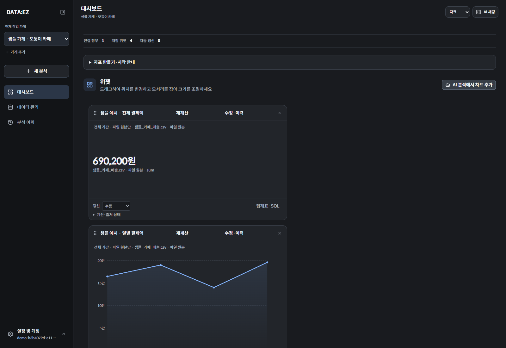
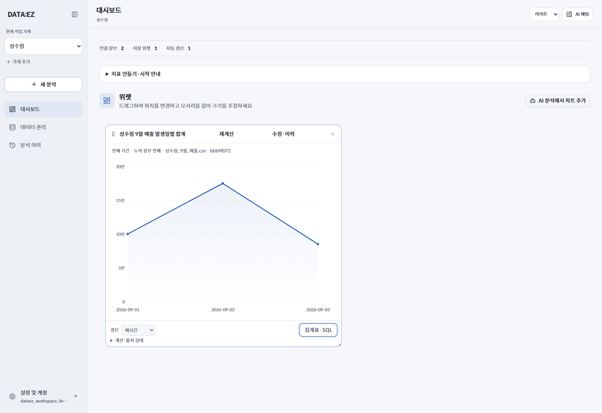

# DATA:EZ — BI·이미지 생성 세션 전달서

작성: 2026-09-10 · 제품 기준: `071ea54` (`codex/demo-environment`)

이 문서는 이전 대화를 읽지 않은 디자이너·이미지 생성 세션을 위한 독립 브리프다. **BI는 Brand Identity, 브랜드 아이덴티티를 뜻한다.** 서비스는 이미 동작하며, 이번 작업은 서비스의 이름·가치를 로고와 시각 자산으로 구체화하는 것이다. 아래에서 사용자 확정 사항, 현재 구현, 새 디자인 제안을 구분한다.

## 1. 서비스 이해

**DATA:EZ는 여러 곳에 흩어진 소상공인의 매출 파일을 모으고, 자연어로 원하는 통계와 그래프를 만들어 편집 가능한 대시보드에 저장하는 서비스다.**

핵심 사용자는 현금 장부, 카드 매출 파일, 예약·판매 채널의 자료를 따로 확인하는 소상공인이다. 한 사람이 여러 가게를 운영할 수 있다. 개발자나 데이터 분석가만을 위한 SQL 편집기가 아니라, 자기 가게의 숫자를 확인하고 싶은 사람을 위한 도구다.

대표 상황: 카페 사장이 카드 매출 CSV와 현금 기록을 보관한 뒤 “선택한 파일에서 날짜별 결제액을 보여줘. 취소도 반영해줘”라고 질문한다. 그래프와 정확한 집계표를 확인하고 저장하면, 다음 접속에도 같은 대시보드를 볼 수 있다.

| 사용자가 하는 일 | 서비스가 제공하는 가치 |
|---|---|
| CSV·엑셀 원본을 보관하고 채팅에서 다시 선택 | 필요한 자료를 찾아 반복 활용 |
| 자연어로 기간·결제수단·가게·계산식을 지정 | 원하는 지표를 직접 제작 |
| 그래프와 집계표·출처·실행 SQL 확인 | 숫자의 계산 근거를 확인 |
| 위젯 저장·이동·크기 조절·재계산 | 자기 업무에 맞는 대시보드를 계속 사용 |
| 여러 가게를 선택·전환 | 가게별 관리와 명시적으로 선택한 비교 |

핵심 흐름은 **파일 → 질문 → 검증된 계산 → 그래프 → 내 대시보드**다. LLM이 구조화된 지표 정의를 만들고 서버가 권한·출처·조건을 검증해 SQL로 계산한다. 검색은 관련 자료를 찾고, 집계는 실제 데이터를 계산한다. 이 기술 설명은 작업자의 이해를 위한 것이며 브랜드의 대표 문구에 SQL·RAG·메타프로그래밍을 모두 나열할 필요는 없다.

## 2. 현재 제품의 범위

현재는 포트폴리오·시연 완성도를 우선한다. 실제 앱에서 파일 보관, 자연어 분석, 저장·재계산, 다점포 관리와 샘플 체험을 구현했다. Docker 기반의 지속형 로컬 데모가 있으며, 재시작 후 파일·대화·지표·배치 보존을 검증했다. 이 사실을 실제 고객 도입이나 서비스 운영 실적으로 표현하지 않는다.

브랜드 설명에 반영할 경계:

- 파일을 업로드하고 연결한 데이터를 분석한다. 외부 PG 자동 연결·매출 수집은 현재 제공하지 않는다.
- 주기 갱신은 서버에 있는 데이터를 다시 계산한다. “모든 결제를 실시간 자동 수집”한다고 표현하지 않는다.
- 원본 파일만 분석하거나 연결된 누적 장부를 분석할 수 있다. 여러 가게를 합칠 때는 사용자가 대상을 선택한다.
- 실제 결제·환불 실행, 은행 계좌 관리, 세무 신고, 투자·매출 예측 서비스는 현재 범위 밖이다.
- “100% 정확한 AI”, “모든 금융기관 연동”, 고객 수·절감 시간·성장률처럼 확인하지 않은 성과를 홍보 문구에 넣지 않는다.

## 3. 사용자 확정 사항 — 유지할 기반

| 항목 | 결정 |
|---|---|
| 서비스 이름 | 이 문서와 주요 UI의 표기는 **DATA:EZ**. 사용자 대화·일부 코드에서는 DATAEZ도 사용 |
| 주 팔레트 | **Charcoal + Blue, 차콜·블루** |
| 테마 | **다크 기본, 라이트·시스템 지원** |
| UI 글꼴 | **Spoqa Han Sans Neo**, 400·500·700 |
| 정보 구조 | 왼쪽 메뉴·가게 선택, 중앙 분석·대시보드, 오른쪽 접이식 AI 채팅 |
| 차트 | **Apache ECharts**, 실제 앱은 6.1.0 SVG 렌더러 |

새 이름을 만드는 작업은 요청받지 않았다. 워드마크 시안의 기본 철자는 `DATA:EZ`로 유지한다. 콜론의 조형·간격은 탐색할 수 있지만 콜론의 공식 의미, 영문 약어 확장, 한국어 읽는 법은 아직 확정된 브랜드 서사로 제시하지 않는다.

현재 앱에는 `DATA:EZ` 텍스트, 접힌 메뉴의 `D:`, 예전 막대그래프 파비콘이 있다. 로그인·브라우저 제목에는 `DATAEZ`도 남아 있다. **기존 텍스트·아이콘은 구현 현황이며, 최종 승인된 로고 시스템으로 취급하지 않는다.** BI 확정 뒤 표기를 일관되게 정리할 수 있다.

### 실제 앱 색상

아래 값은 현재 `web/app/theme.css`에서 확인했다. 다크 강조 블루와 주요 버튼 블루는 역할이 달라 값도 다르다.

| 역할 | 다크 | 라이트 |
|---|---|---|
| 작업 배경 | `#191B1F` | `#F5F7FA` |
| 사이드바 | `#121417` | `#EDF0F4` |
| 패널 | `#22252A` | `#FFFFFF` |
| 채팅 배경 | `#1D2026` | `#F7F9FC` |
| 주요 텍스트 | `#F2F4F7` | `#20262F` |
| 보조 텍스트 | `#A8B0BB` | `#5B6574` |
| 강조·주요 차트 | `#82B4FF` | `#245BB5` |
| 주요 버튼 배경 | `#316AC4` | `#245BB5` |
| 주요 버튼 글자 | `#FFFFFF` | `#FFFFFF` |
| 비교 계열·앰버 | `#DEB77B` | `#8D631F` |
| 취소 계열·로즈 | `#E3A0A8` | `#A74659` |
| 분석 가능 상태·그린 | `#8BCEAF` | `#28724F` |

차트·상태 색에는 이미 역할이 있다. 앰버·로즈·그린을 로고에 모두 넣어야 한다는 뜻은 아니다. BI 기본 조합은 차콜·블루·흰색에서 출발한다. 취소 거래의 로즈는 오류 상태와 구별한다.

### 글꼴

UI 본문·제목·금액은 Spoqa Han Sans Neo를 사용한다. 한글 폴백은 Noto Sans KR, SQL·코드 전용은 JetBrains Mono다. 금액은 소수 정밀도를 유지하고 숫자 폭과 정렬을 맞춘다. **UI 글꼴을 다시 선정하는 세션은 아니다.** 로고 글자는 별도 조형을 제안할 수 있으며, Spoqa와 함께 배치했을 때 어울리는지 확인한다.

## 4. 브랜드 방향 제안 — 아직 사용자 미확정

작업 가설: **흩어진 매출을 이해할 수 있는 숫자로 정리하는, 차분하고 명료한 업무 도구.**

추천 인상은 명료함·근거가 보이는 신뢰감·정돈됨·접근하기 쉬움이다. 금융 데이터의 정확한 표시와 일상적인 사용성을 함께 드러내면 좋겠다. ‘AI’는 질문으로 작업을 줄여주는 방식으로 나타내고, 로봇 캐릭터가 브랜드의 필수 요소라고 가정하지 않는다.

시각 방향의 출발점으로 다음 세 안을 제안한다. 이 안들은 승인된 로고가 아니며 더 좋은 대안이 있으면 근거와 함께 조정할 수 있다.

| 탐색안 | 시각적 질문 | 주의할 점 |
|---|---|---|
| A. 콜론을 활용한 워드마크 | `DATA:EZ`의 구두점·리듬으로 자료와 해석의 연결을 표현할 수 있는가? | 개발자 터미널 전용 도구처럼 읽히지 않는가? |
| B. 흩어진 기록이 정리되는 심볼 | 여러 기록이 하나의 읽기 쉬운 단위로 모이는 모습을 간결한 형태로 표현할 수 있는가? | 흔한 데이터베이스·큐브 아이콘과 구별되는가? |
| C. 질문이 지표가 되는 그래픽 | 질문의 흐름이 선·점·정렬된 지표로 이어지는 시각 언어를 만들 수 있는가? | 말풍선과 상승 화살표를 단순 조합한 모양에 머무르지 않는가? |

대표 그래픽은 앱의 숫자·차트를 읽는 데 방해가 없는 구조가 좋다. 네온·금속·우주 배경·복잡한 3D 장식이 필요하다면 제품과의 연결을 설명한다. 마스코트와 무거운 모션은 우선 산출물이 아니다. 정적인 심볼과 한 장의 대표 이미지부터 제품에서 작동하는지 판단한다.

카피 초안도 함께 비교할 수 있다. 아래 문구는 모두 제안이다.

- “흩어진 매출을, 한눈에.”
- “물어보면 보이는 우리 가게의 숫자.”
- “내가 묻고, 내게 맞게 보는 매출.”

실제 기능을 설명하는 보조 문구 후보: “파일을 모으고, 대화로 지표를 만들고, 내 대시보드에 저장하세요.”

## 5. 다음 세션의 작업 순서와 산출물

### 첫 작업: 3개 방향을 눈으로 비교

이 브리프를 읽고 서비스 이해를 짧게 정리한 뒤 BI 방향 3개를 실제 이미지로 제시한다. 각 안에는 콘셉트 한 문장, 워드마크·심볼, 다크·라이트 적용, 작은 아이콘 적용, 대표 이미지의 분위기를 포함한다. 긴 글만 제시하거나 세 안을 하나의 작은 이미지에 압축하지 않는다. 사용자가 차이를 볼 수 있는 크기로 개별 시안을 만든다. 작업자의 추천 1개와 이유도 적는다.

### 선택한 방향을 구체화

| 우선순위 | 산출물 | 용도·목표 |
|---|---|---|
| 1 | 가로 워드마크·독립 심볼 | 앱 사이드바, 로그인, 소개 자료 |
| 1 | 다크·라이트·흑백 버전 | 색을 제거해도 식별되는 기본형 |
| 1 | 작은 아이콘 | 16·32px 파비콘, 24px 메뉴, 512px 대표 아이콘에서 비교 |
| 1 | 대표 이미지 | 포트폴리오·서비스 소개용 16:9, 권장 1920×1080 |
| 2 | 링크 공유 이미지 | 1200×630, 제목이 가장자리에서 잘리지 않도록 여백 확보 |
| 2 | 간단한 브랜드 가이드 | 로고 여백·최소 크기·색·글꼴·배경 적용·카피 톤 |
| 3 | 보조 일러스트·모션 | 선택한 BI가 정리된 뒤 빈 화면·첫 사용 안내 등에 확장 |

이 표는 제안 범위이며 모든 응용물을 첫 응답에 한꺼번에 만들 필요는 없다. 선택 단계에서는 서비스 코드·테마·기존 파비콘을 곧바로 교체하지 않는다. 먼저 비교 가능한 결과를 남긴다.

이미지 생성 결과는 콘셉트 시안이다. 최종 로고의 글자·콜론·간격은 별도로 검수한다. SVG가 필요하면 실제 벡터 경로로 제작·검수하며 PNG를 넣은 파일을 벡터 원본이라고 부르지 않는다. 긴 한글 문구는 가능하면 별도 텍스트 레이어로 조판한다. 사진·추상 이미지와 기능을 설명하는 실제 앱 화면을 구분한다.

### 선택 기준

1. 파일을 모아 가게의 숫자를 이해하는 서비스라는 인상과 연결되는가?
2. `DATA:EZ`를 읽기 쉽고, 16·32px 심볼과 단색에서도 형태가 남는가?
3. 확정된 차콜·블루와 Spoqa UI에 자연스럽게 들어가는가?
4. 다크·라이트 양쪽에서 식별되며 차트·숫자의 정보 전달을 해치지 않는가?
5. 다른 서비스의 로고를 그대로 연상시키는 조합이나 확인되지 않은 기능 약속에 의존하지 않는가?

## 6. 참고 화면과 레퍼런스의 의미

사용자가 제공한 OpenAI Platform 화면은 **차콜 배경, 간결한 메뉴, 얇은 구분선, 정보 밀도**를 참고한 것이다. 그 회사의 로고·모델 이미지·브랜드 자산을 DATA:EZ 정체성으로 재사용하자는 요청은 아니다.

앞선 팔레트 비교에서 토스·Mercury·Stripe Sigma·캐시노트·Square를 참고했고 최종적으로 DATA:EZ의 차콜·블루를 선택했다. 기존 비교 기록은 팔레트 선택의 배경이며 새 로고의 확정 레퍼런스 목록은 아니다. 이 전달서를 위해 외부 사이트를 새로 조사하지 않았다.

아래 두 이미지는 합성 데이터로 실제 앱을 실행한 화면이다. 제품의 현재 UI 맥락으로 사용한다. 두 캡처는 서로 다른 데이터·검증 시점이며, 동일 데이터의 테마 전환 전후 비교는 아니다.

다크: Phase 1 샘플 대시보드. 원본 8행 합계 690,200원.

라이트: 이전 실제 통합 검증의 성수점 대시보드. 배경·텍스트·차트 대비를 참고한다.

소개 이미지에 수치가 필요하면 다크 샘플 기준을 재사용할 수 있다. 총 690,200원 = 카드 582,700원 + 현금 107,500원, 기간은 2026-09-01~04다. 가상 시연 데이터라고 표시하며 고객 성과로 바꾸지 않는다.

## 7. 같은 저장소에서 이어가는 경우

작업 루트는 `D:/Github/DATAEZ`다. 우선 이 문서만 읽어도 브랜드 작업을 시작할 수 있다. 세부 확인이 필요할 때 아래를 읽는다.

| 경로 | 확인할 내용 |
|---|---|
| `docs/PRD.md` | 사용자·가치·제품 범위 |
| `web/app/theme.css` | 실제 앱의 현재 색상 토큰 — 색의 기준 |
| `web/app/layout.tsx`, `web/app/globals.css` | 실제 폰트·테마 설정 |
| `docs/COLOR_PALETTE.md`, `docs/TYPOGRAPHY.md` | 사용자가 팔레트·폰트를 선택한 기록 |
| `docs/PALETTE_REFERENCES.md` | 과거 레퍼런스 비교 |
| `web/components/dashboard/sidebar.tsx`, `web/app/page.tsx`, `web/public/favicon.svg` | 기존 이름 표기·로고 자리·파비콘 |
| `docs/DEMO_RUNBOOK.md` | 실제 앱 실행 방법 |

일부 과거 문서에는 색상·차트가 아직 시안이라는 당시 설명이 남아 있다. 현재 앱은 확정 테마·Spoqa·ECharts가 적용된 상태다. 구현 상태는 실제 코드와 최신 데모 기록을 우선한다. 브랜드 작업에 인증정보·API 키·비공개 테스트 세션은 필요하지 않다.

다음 결과는 `outputs/brand/`에 방향별로 저장하고, 사용자 선택과 확정한 규칙은 `docs/brand/BRAND_DECISIONS.md`에 남기는 것을 제안한다. 현재는 브랜드 방향을 아직 선택하지 않았으므로 결정 문서는 만들지 않았다.
