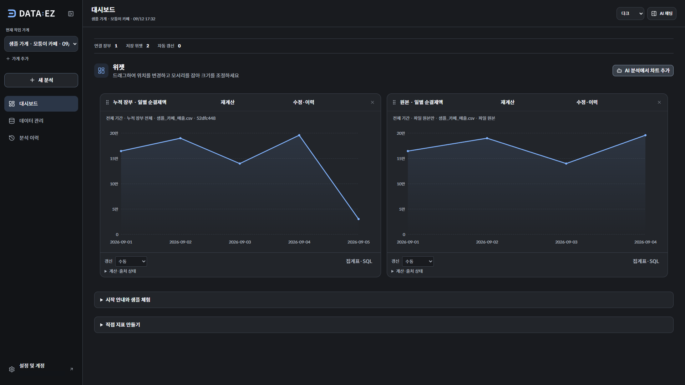
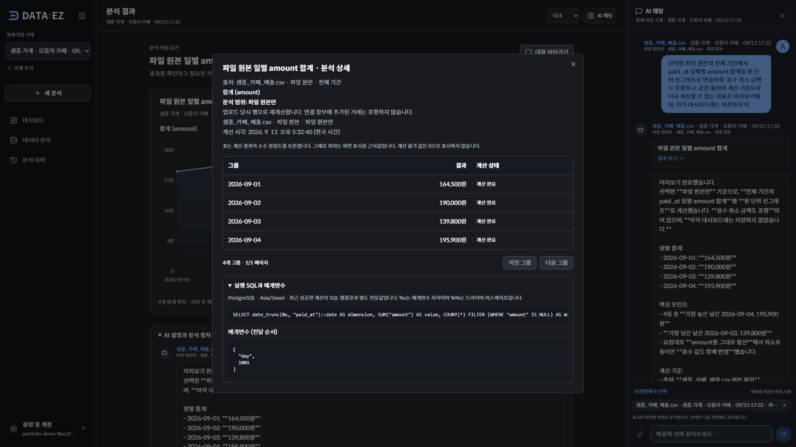

# DATA:EZ — 자연어로 만들고 다시 계산하는 매출 대시보드

2026-09-12 · 실제 공개 서비스와 합성 데이터로 제작한 포트폴리오 사례

**우리 가게 매출, 한눈에.** DATA:EZ는 여러 가게의 매출 파일과 현금 기록을 모으고, 자연어로 필요한 통계를 만들어 저장하는 서비스다. 분석 결과에는 그래프뿐 아니라 집계표·SQL·출처·기간이 함께 남는다. 저장한 지표는 새 거래가 반영된 장부에서 같은 기준으로 다시 계산한다.

[공개 앱](https://dataez.vercel.app) · [영상·자막](VIDEO_RELEASE.md) · [검증 기록](ACCEPTANCE.md) · [소스 코드](https://github.com/gnb1202/DATAEZ)



실제 앱에서 만든 두 지표다. 합성 거래 30,000원을 추가한 뒤 원본의 집계표 합계는 **690,200원**, 누적 장부는 **720,200원**이다. 그래프·금액을 합성하지 않았고 계정 표시 영역만 가렸다. [라이트 화면](assets/phase-2-dashboard-light.png)

## 1. 누구의 어떤 문제인가

대상은 현금·카드 등 여러 결제수단과 채널에서 매출을 올리고, 한 계정으로 여러 가게를 관리하는 소상공인이다. 현금은 따로 적고 카드 내역은 파일로 받아 보관하면, 같은 기간의 수치를 비교할 때마다 자료를 다시 모으고 표를 손봐야 한다. 필요한 통계가 기존 대시보드에 없다면 직접 수식을 만들거나 다른 도구로 옮겨야 한다.

이 문제를 제품 가설로 삼아 **자료 보관 → 통계 요청 → 근거 확인 → 저장 → 재계산**을 한 흐름으로 구현했다. 실제 고객 인터뷰나 매출 개선 효과를 확인한 사업 사례는 아니다. 현재 목표는 공개 배포에서 이 흐름을 재현하고 기술적 판단을 설명할 수 있는 포트폴리오다.

## 2. 실제 사용 흐름

공개 앱에서 회원가입·로그인 후 샘플 가게로 시작하거나 자신의 가게와 파일을 만들 수 있다. 기본 샘플 가게와 아래 촬영 데이터는 별개다. 동일한 숫자로 재현하려면 [원본 CSV](../../samples/demo/portfolio-original.csv), [추가 거래 CSV](../../samples/demo/additional-transaction.csv), [시연 준비·복구 절차](RUNBOOK.md)를 사용한다. 촬영 계정의 자격증명은 공개하지 않는다.

1. 보관함에서 파일을 선택하고 **파일 원본만**을 확인한다.
2. 다음 질문을 전송하고 결과의 차트·집계표·실행 SQL을 확인한다.
3. 이름·단위·기간·갱신 주기를 검토해 저장하고 위젯을 이동·리사이징한다.
4. 같은 파일에 연결된 **누적 장부 전체**로 지표를 하나 더 만든다.
5. 장부에 거래를 추가하고 두 지표를 다시 계산해 범위 차이를 확인한다.

실제 촬영 질문:

> 선택한 파일 원본의 전체 기간에서 paid_at 날짜별 amount 합계를 원 단위 선그래프로 만들어줘. 음수 취소 금액도 포함하고, 같은 출처와 계산 기준으로 다시 계산할 수 있는 지표로 미리보기해줘. 아직 대시보드에는 저장하지 마.

이 질문은 촬영 조건을 명시한 검증용 표현이다. 어떤 모호한 질문도 자동으로 정확히 해석한다는 의미는 아니다. [누적 범위 질문과 기대값](scenario.json)



제품 영상은 110초, 기술 설명은 300초, 반복 발췌는 12초다. [영상 안내](VIDEO_RELEASE.md)에서 자막과 대표 장면을 볼 수 있다. 영상 마스터는 제작 환경의 로컬 파일이며 공개 영상 URL은 아직 없다. 원본 녹화와 편집 결정을 보존했고, 모델 대기를 영상 길이로 바꾸어 성능처럼 설명하지 않는다.

## 3. 자연어가 실행 가능한 통계가 되는 과정

```text
계정·가게에 속한 파일 또는 장부 선택
    → LLM이 도구 인자와 지표 정의 제안
    → 서버가 소유권·출처·컬럼·집계 조건 검증
    → 파라미터화된 SQL 구성·DB 집계
    → ECharts + 정확한 집계표 + SQL·출처 표시
    → 사용자 설정 검토·정의 저장
    → 저장 정의로 재계산
```

RAG는 관련 파일·스키마·문서를 찾는 역할이다. 정확한 금액은 검색 문장이나 LLM의 암산이 아니라 선택한 구조화 데이터의 DB 집계로 구한다. 이번 영상은 파일을 명시적으로 선택해 `library_references`와 `preview_metric`을 사용했으므로 RAG 검색 실행을 촬영한 증거는 아니다. 별도 [RAG 평가](../RAG_ACCEPTANCE.md)와 구분한다.

현재 웹과 FastAPI는 Vercel, PostgreSQL·pgvector·비공개 원본 Storage·Cron은 Supabase를 사용한다. 인증은 FastAPI 자체 JWT이며 Supabase Auth를 사용한 구성은 아니다. 모델 호출은 API 서버에서 실행한다. [배포 구조도 HTML](architecture.html)은 내려받아 브라우저로 열 수 있고, [코드 구조 설명](../ARCHITECTURE.md)은 로컬과 서버리스 프로필을 구분한다.

## 4. 네 가지 기술 선택

### 자유 형식 코드 대신 구조화된 지표 정의

LLM이 만든 임의 SQL이나 Python을 그대로 실행하면 표현력은 넓지만, 사용자·가게·출처 경계를 일관되게 검사하기 어렵다. DATA:EZ는 집계·그룹·필터·기간·차트 모양을 형식이 정해진 정의로 받고 서버 컴파일러가 SQL을 만든다. 실행할 때마다 소유권과 출처 소속을 확인한다.

저장 단위도 이미지가 아닌 정의와 출처다. 일반적인 재계산은 같은 정의를 다시 실행하므로 LLM을 재호출할 필요가 없다. 차트의 숫자 표현과 정확한 금액 근거를 구분해 집계표에서 확인할 수 있게 했다.

그 대신 지원하지 않는 계산은 새 스키마·컴파일러·검증이 필요하다. 임의 프로그램 실행이나 환율 변환까지 지원하는 범용 분석 환경은 아니다. 정의가 없는 정적 차트는 여전히 스냅샷으로 저장된다.

근거: [정의 스키마](../../api/app/metric_definitions.py), [컴파일·실행·저장](../../api/app/dashboard_metrics.py), [저장 전 검토 UI](../../web/components/dashboard/metric-save-settings.tsx).

### 원본 파일과 누적 장부를 별도 범위로 유지

업로드한 파일을 계속 바뀌는 장부와 동일시하면 “이 파일의 합계”가 다음 업로드 후 달라질 수 있다. 파일 원본 분석은 보관된 파일에서 만든 불변 행을 사용하고, 누적 분석은 연결 장부의 이후 거래까지 포함하도록 구분했다. 선택한 범위는 저장 정의의 출처에 남는다.

| 시점 | 원본 분석 | 누적 장부 분석 |
|---|---:|---:|
| 최초 8행 | 690,200원 | 690,200원 |
| 장부에 30,000원 1회 추가 | 690,200원 · 8행 유지 | 720,200원 · 9행 |

리허설에서 일별 값과 원본 파일 해시까지 확인했다. 사용자가 여러 가게를 운영해도 다른 가게 자료를 암묵적으로 합치지 않으며, 가게 비교는 명시적인 선택과 검증을 거친다. 불변 분석 행을 별도로 보관하는 저장 비용과 범위 선택을 설명해야 하는 UX 부담이 따른다.

근거: [원본 분석 구현](../../api/app/file_snapshots.py), [범위·삭제 정책](../FILE_SCOPE_AND_FIRST_USE.md), [여러 가게 지표](../MULTI_STORE_METRICS.md), [독립 기대값](../../samples/demo/expected.json).

### 서버리스 제약에 맞춘 직접 업로드와 실행 제한

원본 파일 전체를 웹/API 요청 본문으로 경유시키는 대신, API가 서명된 업로드 대상을 발급하고 브라우저가 비공개 Storage로 직접 보낸다. 완료 API는 세션 소유권과 파일 크기·SHA-256을 확인한 뒤 보관함에 등록한다. 현재 직접 업로드 상한은 20MiB다.

이 방식은 전송과 등록이 분리되므로 미완료 업로드 정리와 중복 완료 처리가 필요하다. 파일 파싱·행 반영까지 무제한 비동기 처리가 된 것은 아니며 요청 시간 안에 처리할 수 있는 범위를 유지해야 한다.

서버리스 기본값은 에이전트 루프 8회, 소프트 토큰 예산 24,000, 턴 제한 200초다. 이는 무제한 분석을 막는 실행 제약이며 응답 시간이나 청구액 상한의 보장은 아니다. 상주 작업 루프는 끄고 Supabase Cron이 보호된 API를 호출해 색인·예정 지표·정리를 제한된 배치로 수행한다. 주기 재계산은 PG 수집과 별개다.

근거: [브라우저 업로드](../../web/app/lib/direct-upload.ts), [완료 검증](../../api/app/direct_uploads.py), [실행 설정](../../api/app/config.py), [Cron 검증](../SERVERLESS_MAINTENANCE.md).

### Redis 없이 DB에 공유 요청 제한과 작업 상태 보관

현재 규모에서는 Redis를 별도 운영하기보다 이미 사용하는 PostgreSQL로 요청 제한과 작업 상태를 유지했다. 서버리스 함수의 메모리만 사용하면 인스턴스마다 요청 횟수가 달라지므로, DB의 원자적 갱신으로 공유 시간창을 검사한다. DB 확인이 실패하면 제한을 생략하지 않고 요청을 거절한다.

AI 시도 횟수의 서버리스 기본값은 사용자별 24시간에 30회, 앱 전체 100회다. 성공한 응답만 세는 방식이 아니며 비용의 금액 한도도 아니다. 로컬 `persistent` 프로필의 메모리 제한과 공개 배포의 DB 제한을 구분했다.

운영 구성은 줄지만 제한 검사마다 DB 접근 비용이 생기고, 제한 기능도 DB 가용성에 의존한다. 높은 요청량에서 경합·지연이 관측되면 Redis 등 별도 공유 저장소 도입을 다시 판단할 수 있다. 현재 배포에는 AWS와 Redis가 없다.

근거: [요청 제한 구현](../../api/app/rate_limiter.py), [서버리스 제한 검증](../SERVERLESS_RELEASE_GUARDS.md), [내부 유지보수 실행](../../api/app/maintenance.py).

## 5. 실제 실패에서 고친 부분

초기 리허설에서는 차트가 표시되고 저장도 가능했지만, 요청한 선그래프가 정적 결과에만 반영되고 재계산 지표는 막대로 생성되는 경우가 있었다. 같은 응답에 그래프가 두 개 생겨 저장 버튼도 중복됐다. HTTP 성공이나 차트 존재 여부만으로는 요구를 만족했다고 판단할 수 없었다.

일반 차트는 `query_data`와 `generate_chart`를 사용하라는 지침이 재계산 지표 지침과 충돌했다. 재계산 요청에서는 `preview_metric`의 정의에 `chart_type=line`, `date_grain=day`를 넣고, 미리보기가 이미 차트를 제공하면 정적 차트를 추가하지 않도록 수정했다. 검사도 차트 수·형태·정의·일별 값·저장 이후 재계산을 함께 확인하게 했다.

수정본에서 새 가게로 두 번 연속 같은 의미의 결과를 얻었다. 이것은 해당 시나리오의 반복 성공이며 LLM의 변동성을 제거했다는 주장은 아니다. 실패와 수정 전 기록도 남겼다. [지침 수정 코드](../../api/app/prompts.py), [시도별 근거](phase-2-rehearsal.json)

화면에서도 저장된 차트보다 시작 안내가 먼저 나와 결과가 첫 화면 아래로 밀렸다. 위젯이 있으면 차트를 먼저 표시하고 안내는 아래에서 펼치도록 바꿨다. 빈 대시보드에는 첫 사용 안내를 유지했다. [대시보드 구현](../../web/components/dashboard/sections/dashboard-section.tsx)

## 6. 무엇을 검증했나

| 범위 | 관측 결과 | 해석의 한계 |
|---|---|---|
| 공개 서비스 리허설 | 수정본 2회 연속, 각 실제 질문 2회·저장 2회·거래 추가 1회·재계산·드래그·재접속·가게 전환 | 합성 데이터의 지정 시나리오 |
| 응답 완료 시간 | 첫 take 9.43초 / 8.66초, 두 번째 9.36초 / 9.07초 | 4회 관측값, 성능 SLA나 평균 벤치마크가 아님 |
| API 회귀 | 525 passed / 260 skipped | DB 환경이 필요한 건너뛴 검사는 실행되지 않음 |
| UI | TypeScript, 워크스페이스 14개 검사, 반응형 28개 화면 통과 | fixture 검사와 실제 서비스 리허설은 별도 |
| 실제 촬영 | 질문 2회·지표 2개·추가 거래 1회, 브라우저 오류 0건 | 같은 제품 흐름의 추가 실행 |
| 영상 출력 | 4개 파일 전체 디코딩, 영상 3종 1배속 전체 재생·정체 0건 | 영상 품질 확인이며 서비스 부하 검사는 아님 |

[리허설·검사·배포 근거](ACCEPTANCE.md), [촬영 기록](phase-3-capture.json), [영상 검수](VIDEO_RELEASE.md)를 연결했다. 공개 리허설의 영속 메시지 API는 토큰 사용량을 제공하지 않아 미확인 값을 `null`로 남겼다. 이를 0토큰이나 무료 호출로 해석하지 않는다. 과거의 다른 평가 결과는 [문서 인덱스](../README.md#검증-근거)에서 데이터셋과 실행 범위를 따로 확인할 수 있다.

## 7. 개발 과정과 기여를 설명하는 기준

이번 고도화와 데모 제작은 개발자와 Codex의 대화·코드 작업으로 진행했다. 제품 소유자는 대상 사용자, 다중 가게, 보관함 파일을 활용하는 채팅, Spoqa 폰트·Charcoal Blue, Redis 제외와 데모 우선 범위를 결정했다. Codex는 이를 바탕으로 구현·리팩터링, 검증 도구 실행, 배포 작업, 시연 자료와 문서 제작을 수행했다.

따라서 모든 코드를 사람이 단독 작성했거나 고객 검증까지 완료한 것으로 설명하지 않는다. 면접에서는 기능 수를 나열하기보다 **요구를 왜 이렇게 제한했는지, 코드의 어느 경계가 이를 보장하는지, 실패를 어떤 검증으로 발견했는지**를 실제 소스와 함께 설명하는 것이 적절하다. 개발 기간·인원별 기여율·사업 효과는 별도로 측정하지 않았다.

짧은 설명 예시:

> 여러 가게의 매출 파일에서 자연어로 통계를 만들고, 같은 기준으로 다시 계산하는 대시보드를 구현했습니다. LLM은 구조화된 지표를 제안하고 서버가 소유권과 계산 조건을 검증해 SQL로 집계합니다. 원본과 누적 장부의 범위를 분리해 새 거래가 들어와도 이전 파일의 통계는 유지됩니다. Vercel과 Supabase에 배포했고 실제 모델을 연결한 반복 시연으로 저장·재계산·재접속을 확인했습니다. AI 코딩 도구를 활용했으며, 설계 판단과 검증 근거를 코드·실행 기록으로 설명합니다.

## 8. 남은 우선순위

1. **영상 공개 전달:** [최종 QA](FINAL_QA.md)에서 공개 체험·오류 복구·자료 일치·로컬 영상 패키지를 확인했다. 영상 공개 호스팅은 사용자 선택에 따라 후속 작업으로 남겼다.
2. **실제 사용자 관찰:** 파일 원본/누적 범위와 저장 설정을 설명 없이 이해하는지 확인하고 막히는 지점을 개선한다.
3. **분석 범위 확대:** 새로운 파일과 모호한 질문을 독립 기대값으로 평가하고, 실패 유형에 따라 스키마·지침·UI를 보완한다.
4. **필요가 확인될 때 운영 확장:** 실제 PG 연동과 대규모 업로드·부하 검증을 수행한다. 관측 근거에 따라 저장소·작업 처리·공유 제한 구성을 재검토한다.

현재 원격 Storage 연결은 완료했다. 실제 PG 파일·외부 결제 연동은 서비스 일정이 정해질 때까지 보류한다. 현재 합성 자료의 성공으로 실제 고객 데이터의 정확성이나 운영 비용을 보장하지 않는다.
