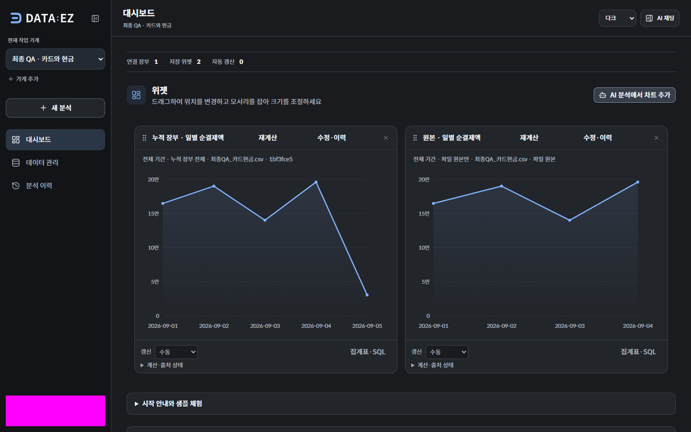

# DATA:EZ 포트폴리오 최종 QA

2026-09-12 · **합의한 범위 통과 · 미해결 P0/P1 없음**

[상세 결과 JSON](phase-5-qa.json) · [사례 문서](CASE_STUDY.md) · [영상 안내](VIDEO_RELEASE.md) · [공개 앱](https://dataez.vercel.app)

새 합성 계정을 공개 UI에서 가입해 가게 생성·파일 보관·분석 연결을 수행했다. 실제 모델로 원본과 누적 지표를 각각 만들고, 저장·거래 추가·재계산·배치·재접속을 확인했다. 계정 접근 차단은 실제 API로, 장애 상황은 로컬 API fixture로 검사했다. 서비스 코드 수정이 필요한 문제는 발견하지 않았고 검사 도구와 문서를 보완했다.

## 검사 기준과 환경

| 구분 | 확인한 환경 |
|---|---|
| 기준 main | `b23c68f687fdc79001502e01e41635b533f9db00` |
| 공개 웹 | Vercel `dpl_GpxpT1cDx1xASXeA5rBhJ9Gad5r5` · READY |
| 공개 API | Vercel `dpl_7HKGyntZsDwhBX9cLwcS2UMdZSTF` · READY |
| 데이터 | 새 합성 계정 A·별도 가게 2개·기준 CSV. 접근 검사 전용 계정 B |
| 실제 질문 | 원본 Q1 / 누적 Q2, 총 2회. 응답 완료 13.14초 / 9.60초 |
| 브라우저 | Microsoft Edge / Chromium. 모바일 크기는 에뮬레이션 |
| 로컬 장애 검사 | 현재 Next.js 앱 + 격리된 API/Storage fixture. 실제 모델 호출 없음 |

Vercel inspect가 배포의 `gitSource`를 제공하지 않아 배포 ID를 로컬 커밋과 동일하다고 추정하지 않았다. 실제 검사는 위 공개 별칭에서 수행했다. 앱의 `web/`·`api/` 코드는 기준 main과 동일하며 별도 앱 배포를 실행하지 않았다. 이번 커밋은 QA 도구·문서·증거를 반영한다.

## 공개 첫 사용과 계산 결과

| 확인 | 결과 |
|---|---|
| 첫 방문 | 새 브라우저의 회원가입 → 빈 화면 → 가게 2개 생성 통과. 샘플 API나 기존 계정으로 준비하지 않음 |
| 파일 | UI 직접 업로드 → 미리보기 → 분석 연결 통과. 내려받은 원본 바이트 일치, 최초 범위는 파일 원본 |
| 분석 | Q1/Q2 각각 선그래프 1개, 재계산 정의·전체 기간·KRW·일별 값·SQL 확인 |
| 저장 | 자동 저장하지 않고 사용자가 설정·미리보기 후 지표 2개 저장 |
| 추가 거래 | 준비 API로 30,000원 거래를 정확히 1회 추가. UI 조작이나 PG 수집으로 설명하지 않음 |
| 재계산 | 원본 8행·690,200원 유지, 누적 9행·720,200원. 원본 파일 해시 유지 |
| 배치·재접속 | 실제 리사이즈 6→12→6열, 드래그, 재접속·가게 전환·새 로그인 후 배치와 설정 유지 |

계정 버튼의 색상 마스크는 QA 캡처의 개인정보 가림이다. 제품 화면의 배경색이나 그래프를 변경한 것이 아니다. 위 결과는 합성 파일의 지정 시나리오이며, 모호한 모든 질문에 대한 정확도나 응답 시간 보장이 아니다. 기준 CSV 합계는 `Decimal`로 별도 계산했다.

## 권한과 실패 복구

| 검사 | 방식과 결과 |
|---|---|
| 접근 격리 | 소유자 성공을 먼저 확인한 파일 상세·미리보기·다운로드·다운로드 URL·장부 데이터·저장 지표 6개 경로에서 비인증/계정 B 접근 차단. 데이터·서명 URL 미노출 |
| 공개 상태 | health/ready 200, 비인증 내부 유지보수 상태 401. 전체 접근·상태 확인 15개 |
| 인증 만료 | refresh 만료 및 access/refresh 동시 만료 2개 fixture. 저장된 세션을 지우고 로그인 화면으로 복귀 |
| 분석 실패 | 스트림 오류·429·503·응답 중단 후 초안과 선택 출처 유지. 기록 조회는 모델 재전송 없이 수행 |
| 저장 응답 유실 | 동일 설정·저장 키로 다시 시도하고 위젯 1개만 생성 |
| 업로드 실패 | 전송 실패·완료 검증 실패를 성공으로 표시하지 않음. 전송 응답 유실은 완료 API의 확인으로 복구 |
| 업로드 제약 | 6MiB 직접 전송에 계정 JWT 미첨부, 원본 다운로드 바이트 일치, 20MiB 초과 사전 거절 |

업로드 fixture 6개, 사용성·오류·키보드·저장 화면 확인 33개를 통과했다. 공개 서버에 부하를 주거나 실제 요청 한도를 소진하지 않았다. 이번 접근 검사는 알려진 소유 자료에 대한 제한된 검사이며 전문 침투 테스트가 아니다.

인증·직접 업로드·파일 범위·서버리스 제한의 선택 API 회귀는 **24 passed / 17 skipped (10.88초)**였다. DB 의존 검사 17개는 이번 로컬 호출에서 실행되지 않았다. 기준 main의 [Tests](https://github.com/gnb1202/DATAEZ/actions/runs/34692373340)와 [Docker Build](https://github.com/gnb1202/DATAEZ/actions/runs/34692373363)는 성공했고, 이전 525개 결과를 이번에 재실행했다고 합산하지 않는다.

## 화면·키보드

로그인·대시보드·집계표·채팅·파일 보관함을 1440×900, 768×1024, 390×844에서 다크/라이트로 확인했다. 공개 화면 검사 32개에서 페이지·작업 영역의 가로 넘침과 브라우저 실행 오류가 없었다. SQL의 의도된 내부 가로 스크롤은 페이지 넘침과 구분한다.

저장 설정은 같은 6개 조합의 로컬 fixture에서 확인했다. 키보드로 로그인, 채팅 열기·닫기, SQL 대화상자, 저장 설정 열기·미리보기·저장·재시도를 수행했다. 모바일 채팅의 포커스 제한과 Escape 복귀도 검사했다.

[모바일 집계표](assets/phase-5-mobile-table.png) · [모바일 저장 설정](assets/phase-5-mobile-save.png) · [200% 배율에 해당하는 레이아웃](assets/phase-5-zoom-equivalent.png)

Headless Edge가 네이티브 확대 단축키를 반영하지 않아, 1440×900의 200%에 해당하는 **CSS viewport 720×450 / DPR 2**로 재배치와 조작 영역을 확인했다. 실제 브라우저 확대 메뉴나 실제 iPhone·Safari를 검사한 것으로 설명하지 않는다. 대표 캡처는 육안으로도 검토했다.

## 영상 전달 패키지

로컬 `output/portfolio-demo-delivery.zip`에 영상 4개 파일, 한국어 SRT, 포스터, 폰트·라이선스, 재생 HTML·안내·해시 목록을 포함했다. 원시 녹화·계정 파일·개발 설정은 포함하지 않았다. ZIP은 Git에 올리지 않는다.

- 18개 항목, 16,954,801바이트. SHA-256과 개별 파일 목록은 상세 JSON에 있다.
- 새 임시 폴더에 압축을 풀고 바이트·상대 경로를 검사했다. 원래 저장소 경로가 없어도 실행된다.
- 압축을 푼 폴더에서 `python -m http.server 3135 --bind 127.0.0.1` 후 브라우저로 접속한다. Python 3이 없으면 MP4를 로컬 영상 플레이어로 열 수 있다.
- 제품 110초·기술 300초·반복 12초를 새 폴더의 서버에서 각각 1배속으로 끝까지 재생했다. 브라우저 표시 누락 프레임 수는 JSON에 그대로 기록했다.
- 영상 4개의 해시가 Phase 3와 모두 같아 기존 전체 디코딩·32개 시점·개인정보 검수 근거를 연결했다. 영상 내용을 새로 편집하지 않았다.

**영상 공개 호스팅과 `/demo` 페이지는 사용자 선택에 따라 제외했다.** README의 공개 영상 URL 미제공 설명은 유지한다.

## 발견 사항과 수정

| 구분 | 발견·처리 |
|---|---|
| 검사 도구 | 과거 사용성 검사가 안내가 펼쳐진 상태를 가정했다. 확정된 차트 우선 배치에 맞춰 안내를 펼친 뒤 접근성을 검사하도록 수정 |
| 검사 도구 | 현재 첨부 흐름의 업로드 capabilities fixture가 빠져 실제 오류 검사 전에 중단됐다. 누락 응답을 추가 |
| 검사 도구 | 대화상자 닫힘 애니메이션의 포커스 복귀와 데이터 로딩 완료 전에 캡처하는 경합을 수정. 저장 설정은 화면에 스크롤한 뒤 확인 |
| 재현성 | 최종 QA는 별도 계정 파일·결과 경로를 사용하고 이미 시도한 분석을 자동 반복하지 않도록 가드 추가 |
| 문서 | 시연 안내의 Phase 0 준비 상태와 현재 완료 상태를 구분하고 새 최종 결과를 연결 |

이는 검사 도구·문서 보완이다. 제품 코드 변경과 그에 따른 재배포는 없었다. 개인정보 검사는 현재 공개 텍스트와 선택한 캡처, 해시가 일치하는 기존 영상 검수에 한정하며 전체 Git 이력 보안 감사가 아니다.

## 재현과 후속 작업

도구는 `scripts/portfolio-demo/final-first-use.cjs`, `final-responsive.cjs`, `final-access.py`, `final-auth.cjs`, `package-final.py`, `publish-final.py`에 있다. 첫 사용 도구는 기존 최종 QA 계정 파일이 있으면 생성·재실행을 거절한다. 기존 완료 자료를 지워 초기화하지 않는다. 일반적인 추가 촬영은 [시연 안내](RUNBOOK.md)의 새 take 절차를 사용한다.

완료 기준인 필수 흐름·주요 실패 복구·로컬 패키지 재생·문서 일치를 확인했고 미해결 P0/P1은 없다. 영상 공개, 실제 사용자 관찰, 실제 PG 파일·연동, 부하·전문 보안 검증은 남은 범위다.
